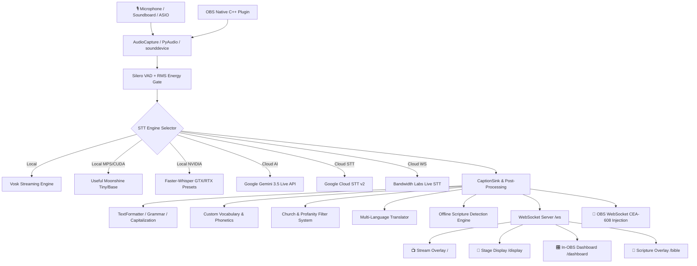

# 🎙️ VoxStream: Master System Architecture & Feature Specification

> **Document Purpose**: This specification serves as the definitive reference for all features, architecture, UI systems, audio pipelines, APIs, and platform integrations in **VoxStream**. It establishes the core invariants and architectural decisions that must be preserved in all future releases.

---

## 📑 Table of Contents
1. [Core Mission & System Overview](#1-core-mission--system-overview)
2. [Audio & Speech Recognition (STT) Engines](#2-audio--speech-recognition-stt-engines)
3. [Text Processing, Formatting & Church Intelligence](#3-text-processing-formatting--church-intelligence)
4. [Offline Bible & Scripture Engine](#4-offline-bible--scripture-engine)
5. [User Interfaces & Display Endpoints](#5-user-interfaces--display-endpoints)
   - [A. Transparent Stream Overlay (`/`)](#a-transparent-stream-overlay-)
   - [B. Multi-Device Stage Confidence Monitor (`/display`)](#b-multi-device-stage-confidence-monitor-display)
   - [C. In-OBS Control Dashboard & Quick Dock (`/dashboard`, `/dock`)](#c-in-obs-control-dashboard--quick-dock-dashboard-dock)
   - [D. Dedicated Scripture Lower-Third (`/bible`)](#d-dedicated-scripture-lower-third-bible)
6. [OBS Studio Integration & Broadcast Protocol](#6-obs-studio-integration--broadcast-protocol)
7. [API Specification & WebSocket Protocols](#7-api-specification--websocket-protocols)
8. [Multi-Platform Launchers & Zero-Touch Automation](#8-multi-platform-launchers--zero-touch-automation)
9. [Configuration Reference (`config.json`)](#9-configuration-reference-configjson)
10. [Future Preservation Invariants (Do Not Break)](#10-future-preservation-invariants-do-not-break)

---

## 1. Core Mission & System Overview

**VoxStream** is a professional-grade, multi-engine real-time speech captioning, live translation, and confidence monitoring suite designed specifically for OBS Studio, live broadcasts, houses of worship, educational institutions, and conference productions.



---

## 2. Audio & Speech Recognition (STT) Engines

VoxStream provides a pluggable engine architecture supporting local offline execution (GPU and CPU) as well as cloud models:

### Supported Engines
1. **Local Vosk (`vosk`)**:
   - 100% offline, zero internet required.
   - Ultra-low latency streaming recognition with instant interim results.
   - Bundled with standard English language model.
2. **Local Useful Moonshine (`moonshine`)**:
   - Next-generation ultra-fast transformer models (`moonshine/tiny` ~27M, `moonshine/base` ~61M).
   - Hardware accelerated: Apple Silicon Neural Engine via **MPS (Metal Performance Shaders)**, NVIDIA CUDA, or CPU fallback.
3. **Local Faster-Whisper (`local_whisper`)**:
   - Built for NVIDIA GPUs with 1-click presets:
     - `🎮 GTX 1660 / 6GB VRAM` (float16 / int8 quantization)
     - `🚀 RTX 3060/4070+ / 8GB+ VRAM` (large-v3 model)
     - `💻 CPU Fast` (int8 optimized)
4. **Google Gemini 3.5 Transcribe Live (`gemini`)**:
   - Conversational speech understanding with system instructions for automatic filler-word removal (*"um"*, *"ah"*, *"like"*).
   - High-accuracy context-aware spelling.
5. **Google Cloud Speech-to-Text v2 (`google_cloud`)**:
   - Enterprise streaming recognition using service account credentials.
6. **Bandwidth Labs Live STT (`bandwidth`)**:
   - Real-time cloud streaming STT over WebSockets.
7. **Free Google Speech Recognition (`google`)**:
   - Zero-setup, API-key-free cloud fallback.

### Voice Activity Detection (VAD)
- **Silero VAD v5** deep learning neural speech detector paired with RMS energy gating.
- Prevents dead air, background room noise, and instrument bleed from triggering false transcriptions.

---

## 3. Text Processing, Formatting & Church Intelligence

All transcribed speech flows through a modular NLP pipeline before delivery:

### Text Formatter (`formatter.py`)
- **Intelligent Capitalization**: Detects sentence boundaries, proper nouns, deity names, days, months, and acronyms.
- **Scripture Verse Formatting**: Detects spoken references (e.g. *"John chapter three verse sixteen"* $\rightarrow$ *"John 3:16"*).
- **Punctuation Heuristics**: Formats questions vs statements using contextual interrogative opening words.

### Custom Vocabulary & Phonetic Replacement (`vocabulary.py`)
- **Phonetic Term Mapping**: Corrects misheard names, theological terms, and brand names (e.g. *"Melchizedek"*, *"Hillsong"*, *"VoxStream"*).
- **Bulk CSV Import / Export**: 1-click import and export of church and organization glossaries.
- **Instant Testing Tool**: Web-based testing tool in the dashboard to verify phonetic replacements before going live.

### Church & Profanity Filter (`censor.py`)
- **Church Mode**: Protects historical and biblical words (*"ass"*, *"bastard"*, *"circumcision"*, *"breastplate"*) from being falsely starred out in sermon contexts while filtering profane slang.
- **Configurable Blacklist & Whitelist**: Real-time CRUD management via web interface.
- **Censorship Styles**: Starred (`****`), Redacted (`[REDACTED]`), or Word-drop.

### Multi-Language Subtitle Translation (`translator.py`)
- Real-time multi-language translation for over 18 languages (Spanish, French, German, Portuguese, Chinese, Japanese, Korean, Arabic, Russian, Hindi, etc.).
- Independent client-side language switching on stage displays and stream overlays (`?lang=es`).

---

## 4. Offline Bible & Scripture Engine

VoxStream includes a built-in, completely offline SQLite Bible engine (`bible_engine.py`):

- **Supported Translations**: Berean Standard Bible (**BSB**), King James Version (**KJV**), World English Bible (**WEB**).
- **Automatic Speech Cues**: When a preacher reads a verse, the system automatically detects the citation and cues the scripture card.
- **Manual Scripture Studio**: Interactive lookup and display control inside the dashboard.
- **Display Targets**: Can be routed to the Stage Display (`/display`), Stream Overlay (`/`), or the dedicated Scripture Overlay (`/bible`).

---

## 5. User Interfaces & Display Endpoints

All web interfaces are zero-dependency, self-contained single-page applications served by an asynchronous `aiohttp` server on port `8765`.

```
http://127.0.0.1:8765/
├── /                     -> Transparent Stream Overlay (OBS Browser Source)
├── /display              -> Multi-Device PWA Stage Confidence Monitor
├── /dashboard            -> In-OBS Master Control Dashboard
├── /dock                 -> Lightweight In-OBS Dock
├── /bible                -> Dedicated Scripture Lower-Third Overlay
└── /api/...              -> REST & WebSocket API endpoints
```

---

### A. Transparent Stream Overlay (`/`)
- **Designed for**: OBS Studio Browser Source (`1920x1080`).
- **Features**:
  - Alpha transparency background.
  - Smooth word entry animations.
  - Multi-theme support (Classic Lower-Third, Modern Pill, Yellow On Black, Neon Outline, Minimalist).
  - Configurable line counts, max characters, and line wrapping.

---

### B. DHH Live Accessibility Reader & Confidence Monitor (`/display`)
- **Designed for**: Deaf & Hard of Hearing (DHH) attendees, personal phone/iPad readers, stage monitors, overflow rooms, choir screens.
- **DHH Audience Experience**: Any attendee on local Wi-Fi can open `http://<IP>:8765/display` on their personal smartphone or tablet to follow spoken sermons, lectures, or presentations in real-time with zero lag.
- **PWA Ready**: Installable as a standalone app on iOS/iPadOS and Android; features **Screen Wake Lock API** to keep screens on continuously.
- **Display Modes**:
  - **Scrollable History**: Retains up to 300 sentences for scrolling back, with smart "⬇️ Jump to Live" button.
  - **Live Prompter**: Keeps 2 high-impact lines with auto-silence fade.
- **Reading Accessibility Studio**:
  - 👁️ **Visual Aid Mode**: Expanded letter spacing (0.06em), word spacing (0.15em), and 1.65x line height.
  - 🐢 **Slow-Down Text Pacing**: Holds words at 140 WPM pace and extends on-screen duration 3x for reading comfort.
  - ⚡ **Bionic Reading Mode**: Applies saccadic eye-fixation formatting by bolding initial syllables of each word for rapid scanning and ADHD/focus support.
- **High Contrast Themes**: OLED Black, Dark Slate, High Vis (Yellow on Black), Stage Amber, Clean Light, Pro Green, Hacker Terminal, Classic Dark.
- **Typography Engine**: Inter, OpenDyslexic, Lexend, Roboto, Bebas Neue, Oswald, Montserrat, Poppins, Lora, JetBrains Mono, Open Sans.
- **Controls & Navigation**:
  - ⚙️ Floating gear button (auto-reveals when header is hidden).
  - ⛶ Cross-browser fullscreen toggle (`requestFullscreen` + `-webkit-` fallback).
  - 🗑️ Instant history wipe button.
  - `+` / `-` Keyboard and button font size scalers (18px to 96px).

---

### C. In-OBS Control Dashboard & Quick Dock (`/dashboard`, `/dock`)
- **Designed for**: OBS Custom Browser Docks (`Docks ➔ Custom Browser Docks...`).
- **10 Core Control Modules**:
  1. **Live Status & Panic Button**: 1-click emergency caption mute, restart, and engine status pill.
  2. **Engine Switcher**: Hot-swap between Vosk, Moonshine, Faster-Whisper, Gemini Live, and Google Cloud with download progress bars.
  3. **Audio Input & VU Meter**: Real-time decibel VU meter and device selector.
  4. **Stream & Overlay Studio**: Real-time theme visualizer and typography styling.
  5. **Offline Scripture Studio**: Scripture citation lookup and broadcast prompter.
  6. **Custom Vocabulary**: Word replacement table with CSV bulk import/export.
  7. **Church Filter**: Blacklist and whitelist phrase management.
  8. **Translation Track**: Global target language routing.
  9. **Model Cache Manager**: 1-click download/delete for Moonshine and Whisper models.
  10. **Export & Logs**: Instant export to `.txt`, `.srt` (SubRip), `.vtt` (WebVTT), and timestamped YouTube Chapters.

---

### D. Dedicated Scripture Lower-Third (`/bible`)
- **Designed for**: Isolated OBS Browser Source dedicated exclusively to Bible verses.
- **Features**: Zero speech captions appear on this layer; only cued or detected Bible verses appear with gold badges and chapter/verse citations.

---

## 6. OBS Studio Integration & Broadcast Protocol

### 1. Embedded CEA-608 / CEA-708 Closed Captions (Native `[CC]` Button)
- Communicates directly with OBS Studio over **OBS WebSocket v5** (`port 4455`).
- Injects standard CEA-608 subtitle packets directly into the RTMP/H.264 stream.
- Activates viewer-toggleable `[CC]` buttons on **YouTube Live** and **Twitch**.

### 2. Native C++ Audio Filter Plugin (`obs_native_plugin/`)
- Optional high-performance C++ audio filter compiled for OBS 64-bit on Windows and macOS.
- Captures audio directly inside the OBS audio graph before mixing, enabling clean speech capture independent of system audio routing.

### 3. OBS Auto-Start Python Script (`obs_script/obs_live_captions.py`)
- Drop-in script for OBS Studio (`Tools ➔ Scripts`).
- Automatically starts and stops VoxStream when OBS opens, streams, or records.

---

## 7. API Specification & WebSocket Protocols

### REST API Endpoints

| Method | Endpoint | Description |
|---|---|---|
| `GET` | `/` | Transparent Live Caption Overlay HTML |
| `GET` | `/display` | Multi-Device PWA Stage Confidence Monitor HTML |
| `GET` | `/dashboard` | Master Control Dashboard HTML |
| `GET` | `/dock` | Compact In-OBS Dock HTML |
| `GET` | `/bible` | Dedicated Scripture Lower-Third HTML |
| `GET` | `/api/status` | Current active engine, uptime, and switching status |
| `GET` | `/api/models/status` | Offline model download and cache status |
| `POST` | `/api/models/download` | Triggers background download of speech model |
| `POST` | `/api/models/cancel` | Cancels active model download |
| `POST` | `/api/models/delete` | Deletes cached model from disk |
| `GET` | `/api/translate` | Translates text query (`?text=...&target=es`) |
| `GET` | `/api/transcript/history` | Returns array of transcribed sentences with timestamps |
| `GET` | `/api/transcript/chapters` | Generates formatted YouTube timestamped chapters |
| `GET` | `/api/transcript/export` | Downloads transcript as `.txt`, `.srt`, or `.vtt` |
| `POST` | `/api/transcript/clear` | Clears transcript history |
| `GET` | `/api/filter/state` | Returns active blacklist and whitelist terms |
| `POST` | `/api/filter/blacklist/add` | Adds word/phrase to profanity blacklist |
| `POST` | `/api/filter/whitelist/add` | Adds word/phrase to theological whitelist |
| `GET` | `/api/vocabulary` | Returns custom phonetic replacement dictionary |
| `POST` | `/api/vocabulary/set` | Adds/updates word replacement pair |
| `POST` | `/api/vocabulary/bulk` | Bulk uploads glossary via CSV |
| `GET` | `/api/vocabulary/export` | Exports glossary as CSV |
| `GET` | `/api/bible/versions` | Lists available offline Bible translations |
| `GET` | `/api/bible/lookup` | Looks up scripture text (`?citation=John+3:16&version=bsb`) |
| `POST` | `/api/bible/display` | Cues scripture display across all monitors |
| `POST` | `/api/bible/dismiss` | Dismisses active scripture lower-third |
| `GET` | `/api/config` | Returns application configuration JSON |
| `POST` | `/api/config` | Updates application configuration JSON |
| `POST` | `/api/control/restart` | Requests safe application hot-restart |
| `POST` | `/api/control/shutdown` | Requests clean application shutdown |

### WebSocket Protocol (`ws://127.0.0.1:8765/ws`)

#### 1. Outgoing Caption Message (Server $\rightarrow$ Client)
```json
{
  "type": "caption",
  "text": "For God so loved the world",
  "is_final": true,
  "timestamp": 1725208800.125
}
```

#### 2. Outgoing Scripture Cue (Server $\rightarrow$ Client)
```json
{
  "type": "scripture",
  "action": "show",
  "citation": "John 3:16",
  "version": "BSB",
  "text": "For God so loved the world that He gave His one and only Son...",
  "duration_seconds": 16.0
}
```

#### 3. Clear Event (Server $\rightarrow$ Client)
```json
{
  "type": "clear"
}
```

---

## 8. Multi-Platform Launchers & Zero-Touch Automation

### Windows
- **`setup_windows.bat`**: 1-click installer. Detects existing Python; if missing, auto-downloads Python 3.11 from python.org, configures `.venv`, installs pip dependencies, and lists PC audio devices.
- **`run_captioner.bat`**: Primary launcher. Handles hot-reloads via **Exit Code `42`** and keeps terminal open on errors for easy troubleshooting.
- **`launch_obs_clean.bat`**: Clears OBS `.sentinel` crash flags to bypass safe-mode prompts on startup.
- **`build_plugin_windows.bat`**: Compiles the native C++ 64-bit OBS audio filter `.dll`.

### macOS / Linux
- **`setup_mac.sh`**: 1-click bash setup. Detects Homebrew/Python, sets up virtualenv, and installs packages.
- **`run_captioner.sh`**: Primary launcher with exit code 42 reload loop.
- **`build_plugin_mac.sh`**: Compiles native macOS C++ OBS audio filter `.so` / `.dylib`.

---

## 9. Configuration Reference (`config.json`)

```json
{
  "engine": "vosk",
  "language": "en",
  "audio": {
    "device_index": null,
    "sample_rate": 16000,
    "channels": 1,
    "energy_threshold": 300,
    "vad_enabled": true
  },
  "web": {
    "host": "0.0.0.0",
    "port": 8765,
    "auth_token": null
  },
  "obs": {
    "websocket_enabled": true,
    "host": "localhost",
    "port": 4455,
    "password": "",
    "send_cea608_captions": true,
    "caption_source_name": "Live Captions"
  },
  "display": {
    "mode": "scrollable",
    "theme": "theme-oled",
    "font_family": "Inter",
    "font_size": 48,
    "visual_aid_mode": false,
    "slow_down_pacing": false,
    "bionic_reading": false
  },
  "censor": {
    "enabled": true,
    "church_mode": true,
    "censor_char": "*"
  },
  "bible": {
    "enabled": true,
    "default_version": "bsb",
    "display_duration_seconds": 14.0
  }
}
```

---

## 10. Future Preservation Invariants (Do Not Break)

To ensure stability in all future refactors and updates, adhere strictly to these architectural invariants:

1. 🔒 **Viewport Clamping**: `html` and `body` in `display.html` must always have `max-width: 100vw; overflow: hidden;` to prevent desktop wallpaper bleeding on tiled or multi-monitor setups.
2. 🔒 **Flex-Shrink Safety on Scripture Prompters**: Elements inserted above the main caption container (like `#scripturePrompterCard`) must have `flex-shrink: 0;` so they never compress or push the caption scrolling area off-screen.
3. 🔒 **Bottom Padding & Flex Calculation**: `.stage-container` must use `flex: 1 1 0; min-height: 0;` rather than `height: 100%;` to ensure bottom lines and safe-area insets are never clipped.
4. 🔒 **Cross-Browser Fullscreen Handlers**: All fullscreen toggle logic must provide `-webkit-` fallbacks (`webkitRequestFullscreen`, `webkitExitFullscreen`, `webkitFullscreenElement`) for Safari and embedded WebKit docks.
5. 🔒 **ClassList Mutation Safety**: When updating theme classes dynamically, always collect classes into an array before removing them to prevent iterator skipping.
6. 🔒 **Exit Code `42` Loop**: All shell scripts (`run_captioner.bat`, `run_captioner.sh`) must catch exit code `42` to support instant hot-restarts triggered from the web UI panic button.
7. 🔒 **Zero External CDN Hard-Lock**: The web server must always provide bundled fallback fonts and local icons so core captioning functions completely offline without internet access.
8. 🔒 **Pure Local Security**: VoxStream is a local broadcast tool. All audio processing must remain strictly on the local machine unless the user explicitly configures a cloud API key.

---
*Maintained by the VoxStream Open Source Broadcast Suite Team.*
