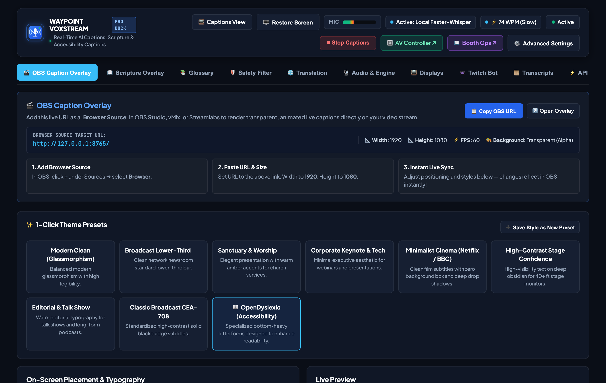
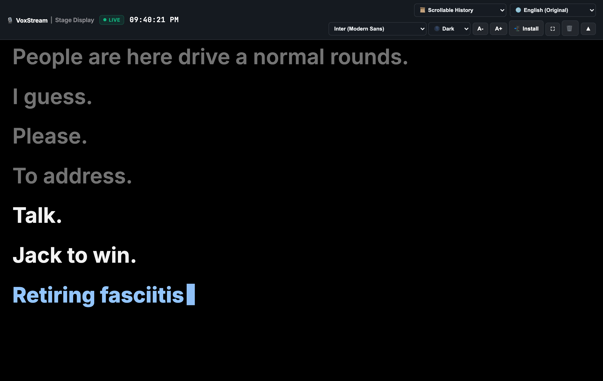
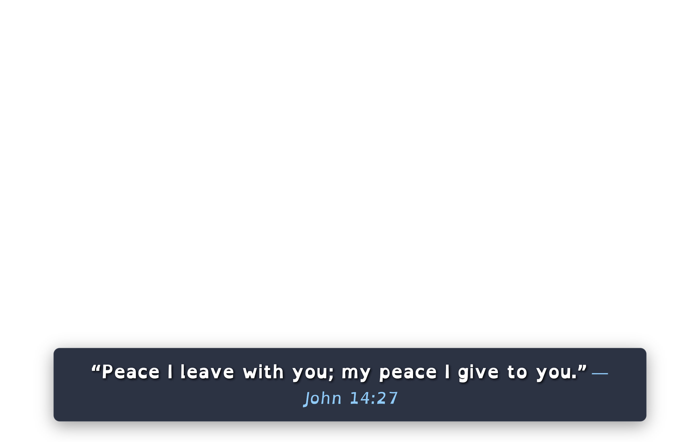
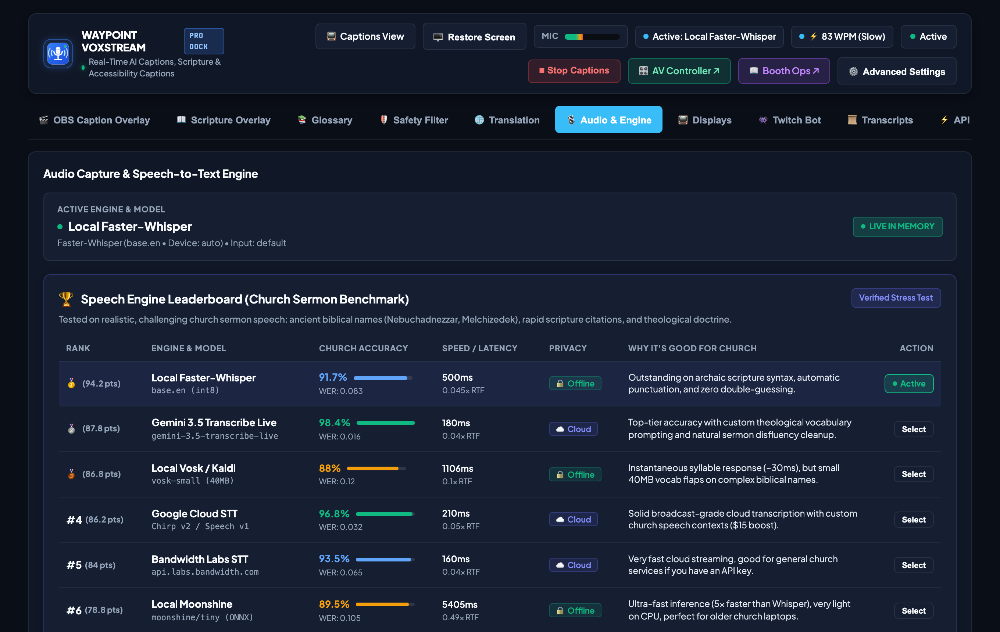
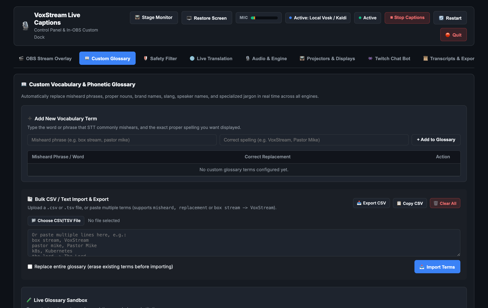

# 🎙️ VoxStream — Real-Time OBS Live Captioner & Broadcast Suite

[](LICENSE)
[](https://www.python.org/)
[](https://obsproject.com/)
[]()
[]()

**VoxStream** is a high-performance, low-latency, real-time speech-to-text captioning and broadcast automation suite for **OBS Studio** on **macOS, Windows, and Linux**.

It features an integrated **In-OBS Web Control Dashboard & Custom Dock**, **7 Powerful Speech Engines** *(Local Vosk / Kaldi, Moonshine, Gemini 3.5 Live, Faster-Whisper, Bandwidth Labs Live STT, Google Web, Google Cloud STT)*, **⛪ Church & Biblical Lexicon with Scripture Citation Parsing**, **Smart Punctuation & Capitalization**, **Multi-Language Live Translation**, **1-Click Theme Gallery**, **PWA Mobile/Tablet Stage Confidence Monitor**, **Twitch Chat Caption Bot**, **YouTube Live CEA-608 Closed Captions**, **Stream Deck / Bitfocus Companion Integration**, and **Automated YouTube Chapters & Subtitle Exporter (SRT/VTT/TXT)**.

---


<p align="center">
  
</p>

## ✨ Key Features Overview

### ⚡ 1. 7 Multi-Tier Speech Recognition Engines (Hot-Switchable)
* ⚡ **Local Vosk / Kaldi (Ultra-Low Latency ~20ms)**: 100% offline, instantaneous speech recognition powered by Kaldi C-core acoustic models. Zero cloud dependency, zero API keys.
* 🌙 **Local Moonshine (ONNX Neural STT)**: Next-generation lightweight neural speech-to-text designed specifically for real-time live streaming (~5x faster than Whisper).
* ✨ **Gemini 3.5 Transcribe Live**: Google's newest multimodal AI (`gemini-3.5-transcribe-live`) with custom vocabulary support, smart punctuation, and automated filler-word cleanup.
* 💻 **Local Faster-Whisper**: 100% offline OpenAI Whisper running locally on your GPU (CUDA) or CPU with beam search and voice activity filtering.
* 🆓 **Free Google Speech (Zero-Setup)**: 100% Free, zero-setup Google Speech engine requiring no API keys or accounts.
* 🌐 **Bandwidth Labs Live STT**: Enterprise-grade streaming real-time speech recognition from labs.bandwidth.com.
* ☁️ **Google Cloud Speech-to-Text**: High-accuracy enterprise streaming with automatic diarization and punctuation.
* 🔄 **Live Hot-Switching**: Switch engines on the fly in the dashboard without interrupting your stream or restarting the server.

---

### 📱 2. Progressive Web App (PWA) & Stage Confidence Monitor (`/display`)
* **PWA Standalone Mode**: Installable directly on **iPads, iPhones, Android tablets, TVs, and laptops** with custom app icon and full-screen standalone window (no URL bars or browser tabs).
* **🔋 Screen Wake Lock API**: Automatically keeps the screen awake so stage podium tablets and confidence monitor TVs never dim or go to sleep during speech.
* **2 Tailored Display Modes**:
  * **`📜 Scrollable History` (Default)**: Full persistent, bi-directional scrollable transcript of the service. Presenters can scroll up with touch or mouse wheel to review earlier points or scripture verses.
  * **`⚡ Live Prompter (Auto-Fade)`**: Displays only the active 2 lines on screen and automatically fades out on silence for clean broadcast teleprompting.
* **Fully Responsive UI**: Fluidly adapts across 4K displays, ultrawide monitors, iPads, and mobile phones with touch-friendly controls and responsive typography.

<p align="center"></p>

---

### 🌐 3. Multi-Track Live Translation & Local Network (LAN) Support
* **Multi-Device LAN Access (`0.0.0.0:8765`)**: Any device on your church or studio Wi-Fi can open `http://<your-ip>:8765/display` in real-time. Supports **200+ simultaneous devices** with `< 5ms` broadcast latency.
* **Independent Per-Screen Settings**: Each device independently chooses its own:
  * **Language Track** (e.g. Spanish in the overflow room, Chinese in the translation booth, English on stage).
  * **Display Mode** (Live Prompter vs Scrollable History).
  * **Font Size & High-Contrast Themes** (OLED Black, Amber Stage, Slate Blue, High Light).
* **30+ Supported Languages**: Real-time translation to Spanish, French, German, Portuguese, Italian, Chinese, Japanese, Korean, Russian, Arabic, Hindi, Dutch, Polish, Swedish, Turkish, Ukrainian, Vietnamese, and more.

---

### 📖 4. Instant Scripture Verse Auto-Lookup & Offline Bible Engine
* **Spoken Citation Auto-Detection**: Recognizes spoken scripture passages in real time across all 66 books (*"John 3:16"*, *"1 Corinthians 13:4-7"*, *"Romans 8:28"*).
* **100% Offline Multi-Translation Database**: Instant (< 0.1ms) verse retrieval from bundled SQLite database:
  * **BSB (Berean Standard Bible)**: Modern, highly accurate translation reading virtually identically to the **ESV**.
  * **WEB (World English Bible)**: Modern clean English equivalent to the **NIV/NLT**.
  * **KJV (King James Version)**: Traditional classic authorized text.
* **Dual-Channel Visual Broadcast**:
  * **OBS Stream Overlay**: Broadcast lower-third card with gold amber badge and smooth animated entry.
  * **Stage Confidence Monitor**: Floating prompter box pinned to stage confidence screens and podium iPads.
  * **Interactive Dashboard Cue Tool**: Search, preview, and manually push or dismiss verses with 1 click.

---

### ⛪ 5. Church, Worship & Biblical Lexicon
* **Sacred Names & Titles of Deity**: Automatically capitalizes and truecases:
  * `God`, `God's`, `Lord`, `Lord's`, `Jesus`, `Jesus Christ`, `Christ`, `Holy Spirit`, `Holy Ghost`, `Heavenly Father`, `Almighty God`, `King of Kings`, `Lord of Lords`, `Son of God`, `Prince of Peace`, `Lamb of God`, `Messiah`, `Savior`, `Yahweh`, `Jehovah`, `Emmanuel`.
* **Spoken Scripture Reference Parser**: Automatically detects and formats spoken Bible references into standard chapter:verse citations:
  * `"John 3 16"` or `"John chapter 3 verse 16"` → **`John 3:16`**
  * `"Romans 8 28"` → **`Romans 8:28`**
  * `"First Corinthians 13 4 through 7"` → **`1 Corinthians 13:4-7`**
  * `"Psalm twenty three"` → **`Psalm 23`**
  * `"In Jesus name amen"` → **`in Jesus' name, Amen`**
* **All 66 Books of the Bible**: Formats canonical names across Old and New Testaments (`Genesis`, `Exodus`, `1 Kings`, `Matthew`, `Philippians`, `Revelation`, etc.).
* **Church Whitelist**: Context-aware filter protects scriptural phrases like `"heaven and hell"` or `"gates of hell"` from false-positive profanity censoring.

---

### 🔤 5. Intelligent Capitalization & Punctuation Engine
* **Sentence Capitalization**: Capitalizes sentence beginnings, standalone pronoun `I`, tech brands & acronyms (`OBS`, `GPU`, `CPU`, `HDMI`, `YouTube`, `Twitch`, `Discord`), and common contractions (`I'm`, `don't`, `can't`, `that's`).
* **Smart Punctuation**: Restores question marks (`?`), exclamation marks (`!`), periods (`.`), and natural comma pauses before coordinating conjunctions.
* **Ultra-Fast Single-Pass Pipeline**: Unified master Trie regex lookup executes in **< 0.08ms** per audio frame with zero perceptible latency.

---

### 📺 6. YouTube Livestream & Twitch Closed Captions (Native [CC] Button)
* **Embedded CEA-608 / CEA-708**: Injects native closed caption packets directly into OBS H.264 stream output headers via OBS WebSocket v5 (`SendStreamCaption`).
* **Viewer Toggleable [CC]**: Viewers on YouTube Live and Twitch can toggle captions on/off right on the video player without permanently burning text into video pixels.
* **Twitch Chat Caption Broadcaster**: Automatically sends live captions into Twitch chat for mobile and hearing-impaired viewers.

<p align="center"></p>

---

### 🤖 7. 1-Click Offline AI Model Downloader & Storage Cache Manager
* **Pre-Download Offline Models**: 1-click batch or individual download for all 7 offline speech recognition models (*Vosk Small/Large, Faster-Whisper Tiny/Base/Small, Moonshine Tiny/Base*).
* **Storage Management**: Visual disk cache inspector with single-model deletion and full cache clearance (`/api/models/delete`).
* **Offline Readiness**: Prepares production systems for zero-internet environments with live download progress bars.

<p align="center"></p>

---

### 🎛️ 8. Complete REST & WebSocket API & Stream Deck / Companion Integration
* Full REST API control for hardware broadcast switchers, Stream Decks, and custom webhooks.
* **1-Button Panic Drop**: Instantly wipe visible captions across all broadcast screens and overlays (`POST /api/control/panic`).
* **1-Button Toggle**: Start or pause speech recognition on demand (`POST /api/control/toggle`).
* **1-Button Theme Switching**: Apply themes on the fly (`POST /api/presets/apply`).
* Complete documentation in [**`API_GUIDE.md`**](API_GUIDE.md) and [**`integrations/streamdeck_companion.md`**](integrations/streamdeck_companion.md).

---

### 📑 9. Custom Vocabulary & Bulk CSV/TSV Glossary Manager
* **Phonetic Replacement Engine**: Automatically replaces misheard slang, proper nouns, brand names, and church jargon in < 0.1ms.
* **Bulk Import & Export**: Import CSV or TSV files, copy/paste multiple terms, or download your entire glossary with 1 click (`/api/vocabulary/export`).
* **Live Sandbox Tester**: Test substitutions in real time before going live.

<p align="center"></p>
* Full REST API control for hardware broadcast switchers and Stream Decks.
* **1-Button Panic Drop**: Instantly wipe visible captions across all broadcast screens and overlays (`POST /api/control/panic`).
* **1-Button Toggle**: Start or pause speech recognition on demand (`POST /api/control/toggle`).
* **1-Button Theme Switching**: Apply themes on the fly (`POST /api/presets/apply`).
* Complete guide and JSON profiles available in [**`integrations/streamdeck_companion.md`**](integrations/streamdeck_companion.md).

---

### 📑 10. Automated YouTube Video Chapters & Subtitle Export
* **Intelligent YouTube Chapters**: Automatically detects scripture readings (*e.g. John 3:16, Romans 8:28*), sermon topic shifts, prayers, and liturgical milestones into timestamped chapter markers.
* **1-Click Copy**: Copy ready-to-paste video descriptions for YouTube uploads directly from the Transcripts tab.
* **Subtitle Export**: 1-click export to **`.SRT`**, **`.VTT`**, and **`.TXT`** with millisecond timecodes.

---

### 🎨 11. Curated Broadcast Theme Gallery & Typography Customizer
* **Pre-Built Themes**: *Modern Clean, Broadcast News Lower-Third, Sanctuary & Worship, Corporate Keynote & Tech, Minimalist Cinema, High-Contrast Stage Confidence, Editorial & Talk Show, Classic Broadcast CEA-708, OpenDyslexic (Accessibility)*.
* **Custom Typography**: Google Fonts (*Inter, Roboto, Montserrat, Oswald, Lora, Poppins, OpenDyslexic*) + custom system fonts.
* **Custom Layouts**: Font Size (16px–96px), Max Box Width (% slider), Max Lines (1–4), Text Alignment, Line Height, and Box Background Opacity.

---

### 🛡️ 12. 3-Tier Content Filtering & Wholesome Replacements
* **Tier 1 (Standard Profanities)**: Filters vulgarities and offensive words.
* **Tier 2 (Harsh Vulgarities & Blasphemies)**: Filters harsh expletives while safely protecting sacred names and scriptural citations. When **Church Mode** is on, ordinary theological vocabulary (e.g. *hell*, *damned* in sermon contexts) is exempt from this tier so scripture readings display verbatim.
* **Tier 3 (Crude Terms)**: Filters crude slang and inappropriate phrases.
* **4 Action Modes**: Wholesome Word Replacement, Asterisk Masking (`****`), `[CENSORED]` Tag, or Drop Sentence.
* **Interactive In-Browser CRUD Editor**: Add/remove custom blacklist words, custom whitelists, and wholesome word replacements in clean visual tables.

---

## 📋 Quick Start Guide

### 🍏 macOS & Linux
```bash
# 1. Clone repository
git clone https://github.com/techguyowen/vox-stream.git
cd vox-stream

# 2. Run automated setup (creates virtual environment & installs dependencies)
./setup_mac.sh

# 3. Start VoxStream
./run_captioner.sh
```

### 🪟 Windows
1. Double-click `setup_windows.bat` (automatically installs Python dependencies).
2. Double-click `run_captioner.bat`.

---

## 🌐 Access URLs (Once Running)

| View | Local URL | Network / Wi-Fi URL | Description |
| :--- | :--- | :--- | :--- |
| **Web Control Dashboard** | `http://127.0.0.1:8765/dashboard` | `http://<YOUR_IP>:8765/dashboard` | Main control panel & In-OBS Dock |
| **Transparent Stream Overlay** | `http://127.0.0.1:8765/` | `http://<YOUR_IP>:8765/` | OBS Browser Source overlay |
| **Stage / Room Confidence Monitor** | `http://127.0.0.1:8765/display` | `http://<YOUR_IP>:8765/display` | PWA Fullscreen Stage Monitor for iPads/TVs |

---

## 🖥️ OBS Studio Setup

### 1. Add the In-OBS Control Dock (Recommended)
1. In OBS Studio, go to the top menu: **Docks $
ightarrow$ Custom Browser Docks...**
2. **Dock Name**: `Live Captions`
3. **URL**: `http://127.0.0.1:8765/dashboard`
4. Click **Apply** and dock the panel anywhere in your OBS workspace.

---

### 2. Add the Transparent Stream Overlay
1. In your OBS Scene, click **+ (Add Source) $
ightarrow$ Browser**.
2. **URL**: `http://127.0.0.1:8765/`
3. **Width**: `1920`, **Height**: `1080` (or match your canvas resolution).
4. Check **"Shutdown source when not visible"** and **"Refresh browser when scene becomes active"**.

---

### 3. Native Closed Captions (YouTube & Twitch [CC] Button) 📺
1. **In OBS Studio**: Go to **Tools $
ightarrow$ WebSocket Server Settings** and check **"Enable WebSocket server"** (Port `4455`).
2. **For YouTube Livestreams**:
   * Open your stream in **YouTube Studio** (Live Control Room).
   * In **Stream Settings**, toggle **Closed Captions** to **ON**.
   * Under **Caption source**, select **"Embedded 608/708"**.
3. **For Twitch Streams**:
   * Twitch automatically reads embedded CEA-608 packets from OBS.
   * You can also use the built-in **Twitch Chat Bot** in the VoxStream dashboard to broadcast captions directly into Twitch chat for mobile viewers!

---

### 4. Auto-Start VoxStream Automatically When OBS Opens 🚀
You can have OBS Studio launch VoxStream in the background automatically whenever OBS opens:
1. In OBS Studio, go to **Tools $
ightarrow$ Scripts**.
2. **On macOS**: In the **Python Settings** tab, ensure your Python path is set (e.g. `/opt/homebrew/Frameworks/Python.framework/Versions/3.11` or `/Library/Frameworks/Python.framework/Versions/3.11`). On Windows, select your Python install folder.
3. Click the **Scripts** tab, click **+ (Add Script)**, and select `obs_script/obs_live_captions.py`.
4. Check **"Auto-start when OBS launches"** and choose your default speech engine (e.g. *Vosk, Moonshine, Bandwidth Labs, etc.*).

---

## ⚡ REST & WebSocket API

| Method | Endpoint | Description |
| :--- | :--- | :--- |
| `GET` | `/api/status` | Returns system status, audio levels, active engine, model detail, uptime |
| `GET` | `/api/config` | Retrieves current configuration JSON |
| `POST` | `/api/config` | Updates configuration & hot-reloads live pipeline |
| `POST` | `/api/control/start` | Starts / unpauses speech recognition |
| `POST` | `/api/control/stop` | Pauses speech recognition |
| `POST` | `/api/control/panic` | Emergency Panic Button: wipes captions from all screens |
| `POST` | `/api/control/restart` | Cleanly restarts backend process |
| `POST` | `/api/control/shutdown` | Gracefully shuts down application |
| `GET` | `/api/presets` | Returns all pre-built visual theme presets |
| `POST` | `/api/presets/apply` | Applies a visual theme preset by ID |
| `GET` | `/api/devices` | Returns list of available audio input devices |
| `GET` | `/api/filter/state` | Returns full censorship rules dictionary |
| `POST` | `/api/filter/blacklist/add` | Adds word to custom blacklist |
| `POST` | `/api/filter/whitelist/add` | Adds word to custom whitelist |
| `POST` | `/api/filter/replacements/set`| Adds/updates wholesome word substitution |
| `GET` | `/api/transcript/history` | Returns recent session transcript entries |
| `GET` | `/api/transcript/chapters` | Returns auto-generated YouTube chapters & scripture markers |
| `GET` | `/api/transcript/export` | Downloads subtitle file (`?format=srt|vtt|txt`) |
| `GET` | `/manifest.json` | PWA Web App Manifest |
| `GET` | `/sw.js` | PWA Service Worker |
| `WS` | `/ws` | Real-time caption event broadcast stream (`?lang=es` for translated) |
| `WS` | `/api/control/ws` | Real-time telemetry, VU meter, and control stream |

---

## 🧪 Testing & Verification

Run the automated test suite:
```bash
.venv/bin/python test_captioner.py
```

---

## 📄 License
This project is licensed under the [MIT License](LICENSE).
